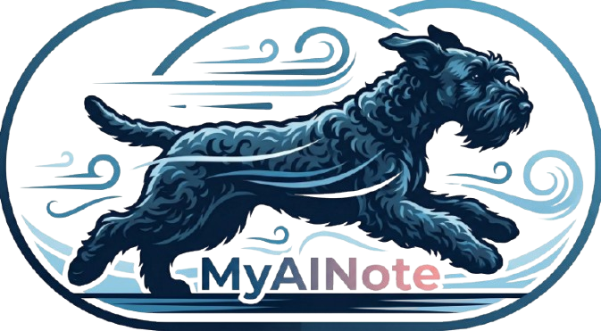

# MyAINote

An AI auto note with saving on iCloud, cross platform: Mac, Windows, Linux, Android, iOS and Chrome Plugin.

## Features 1
1. input a URL，scrape the content and save it to a md file.
- AI abstract the content tags and save it to a md file beginning.
- AI recognize the picture content and save it to a md file.
- AI summarize the content and save it to the same md file at the beginning.
- AI translate the English content and merge it to the same md file.

2. Support URLs
- Xiaohongshu, like: 

## Install and Configure
- Downloade from release page: https://github.com/jasonzhang1989/AutoAINote/releases
- Install on your device and config the AI model.
- Mac should save to your iCloud Drive or Google Drive place or other cloud storage.
- Now we support Google AI Studio API, OpenAI API or OpenAI standard API.

## Usage
- Open the app and input a URL, then click the button to scrape the content and save it to a md file.
- Post andy picture or pdf, docs to the app, then click the button to scrape the content and save it to a md file.

## Plan
1. RAG support for quick search with keywords.
2. Research support base on your knowledge base.
3. Mac and Android will support at first wave.
4. Local vision AI and local AI model(Gemma) support.
5. Audio note support.
6. Audio talk with your knowledge base.
7. Home server support for AI model deployment.

## Tech Stack
1. Next.js
2. Tauri
3. React
4. TypeScript
5. TailwindCSS
6. Shadcn UI
7. AI Models: Google AI Studio API, OpenAI API or OpenAI standard API
8. [Google Gemma](https://deepmind.google/models/gemma/)