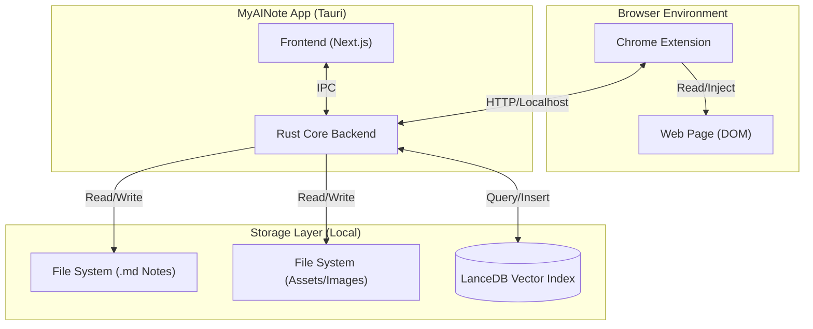
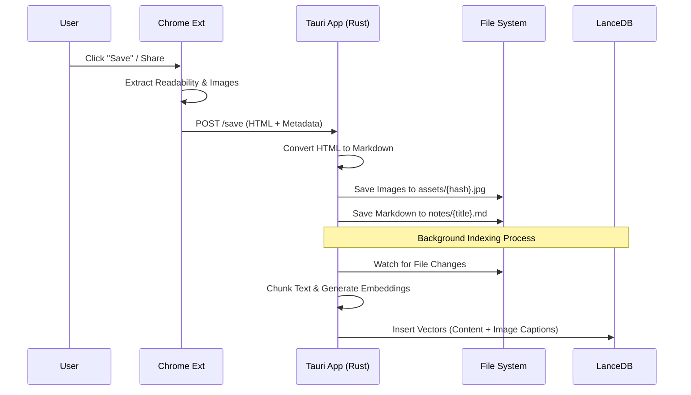
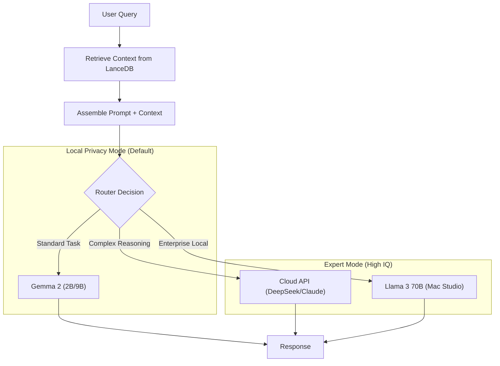
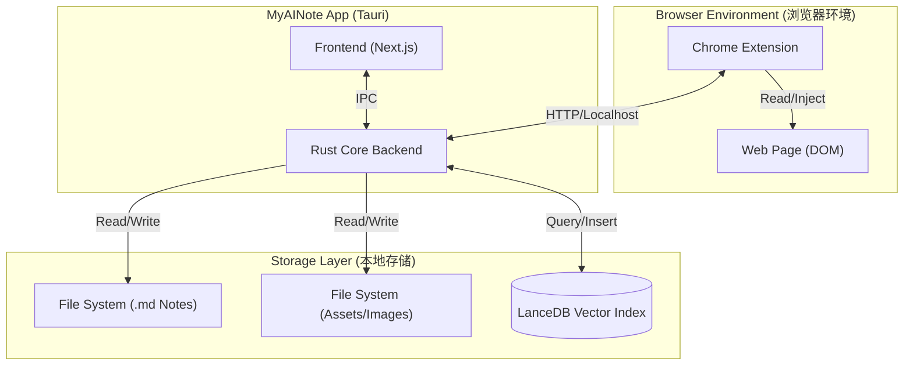
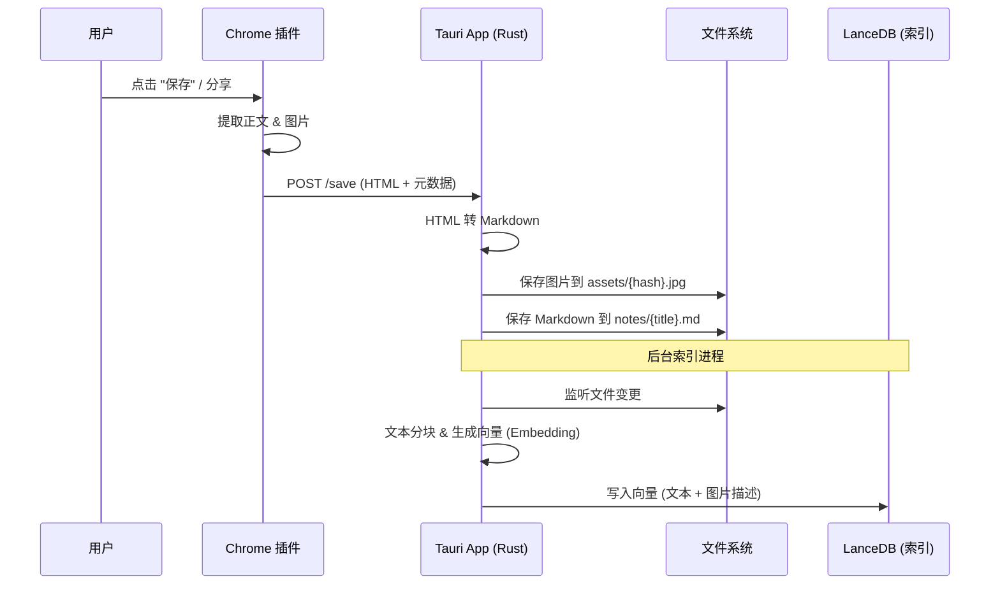
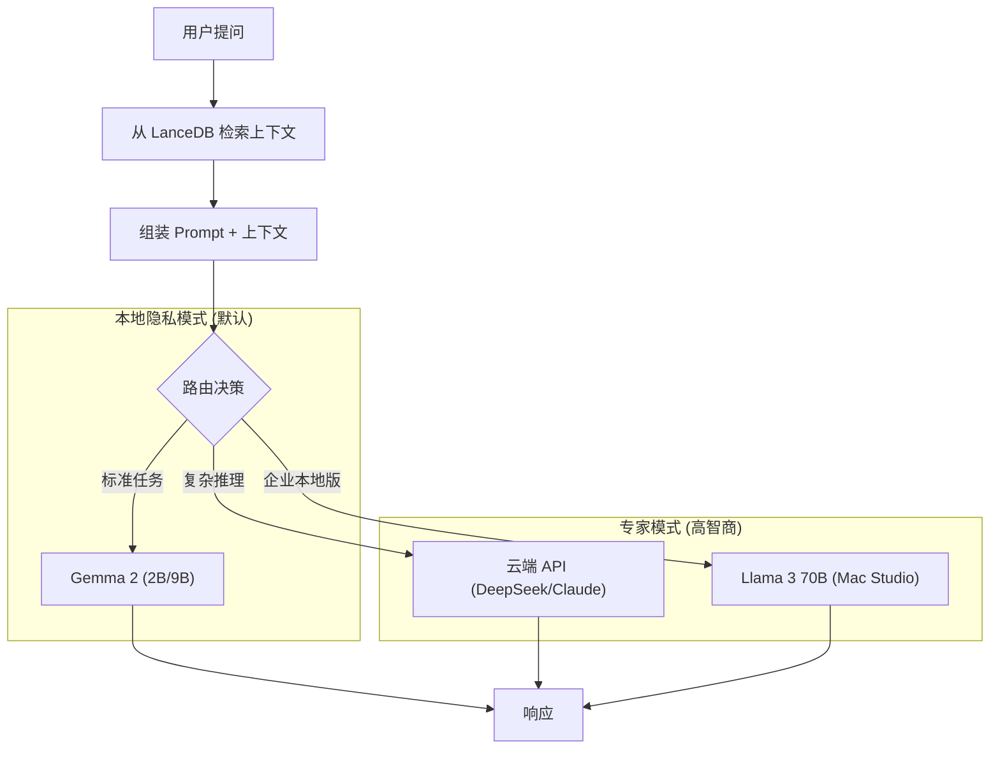

# MyAINote Technical Solution (2025 Edition)

[English Version](#english-version) | [中文版 (Chinese Version)](#中文版-chinese-version)

---

## 1. Architecture Overview: Tauri + Rust + Browser Extension

### Cross-Platform Feasibility (Tauri v2)
**Conclusion:** **Highly Feasible.**
As of late 2025, Tauri v2 is stable and production-ready for mobile (iOS & Android). It allows sharing the core Rust backend and Frontend (Next.js) across Desktop and Mobile.

*   **Core**: Rust (Tauri main process). Handles system tray, file system, window management, and high-performance logic.
*   **Frontend**: Next.js + React + TailwindCSS (Shared UI).
*   **Mobile**: Tauri v2 compiles to native iOS/Android libs, wrapping the webview.
*   **Browser Extension**:
    *   **Role**: Replaces the Node.js sidecar for scraping. The user installs a Chrome Extension that connects to the local Tauri app.
    *   **Benefit**: Uses the user's **existing Chrome profile** (cookies, sessions). No need to re-login to sites like Xiaohongshu.
    *   **Privacy**: All data stays local. The extension sends content *only* to the local Tauri server (localhost).

### Architecture Diagram

#### 1. System Architecture (Component View)

#### 2. Data Flow: Capture to Indexing (Sequence)

#### 3. AI Inference Strategy (Hybrid Router)

## 2. Feature Implementation Strategy

### URL Scraping & Content Extraction
*   **Primary (Browser Extension)**: The extension injects a content script to extract the main article content (using `readability.js` inside the browser).
*   **Workflow**:
    1. User browses to a page (e.g., Xiaohongshu post).
    2. Clicks "Save to MyAINote" extension button.
    3. Extension extracts HTML/Images and POSTs to `http://localhost:port/save`.
    4. Rust backend receives data, converts to Markdown, and saves locally.
*   **Markdown Generation**: Performed by the Rust backend (`html2md`) after receiving the raw HTML.

### Image Preservation & Recognition (OCR)
*   **Storage**: Save images locally in a hashed assets directory (`assets/images/{hash}.jpg`) to avoid duplicates.
*   **OCR/Recognition**:
    *   **Desktop**: Use `tesseract-rs` (Rust bindings) or platform native APIs (Apple Vision on macOS).
    *   **Mobile**: Use native plugins (Tauri plugin system) to access iOS/Android native OCR APIs (Live Text on iOS, ML Kit on Android) for zero-overhead offline OCR.

### Keyword Extraction & Auto-Tagging
*   **Approach**: Use a small, fast local model (e.g., **BERT** or quantized **Gemma 2B**) running in Rust via `candle` or `ort` (ONNX Runtime).
*   **Workflow**:
    1.  Content extracted.
    2.  Passed to local embedding model.
    3.  Extract key phrases or classify into categories.
    4.  Append YAML frontmatter to the Markdown file.

## 3. Advanced Collection & Automation

### Batch & Macro Scraping (Personal Crawler)
*   **Goal**: Automate repetitive tasks (e.g., "Scrape these 10 URLs" or "Login, search for 'AI', and save top 5 results").
*   **Architecture**: **App Orchestration + Extension Execution**.
    *   **The App (Commander)**: Manages the "Task Queue" and stores "Recipes" (JSON-based rules for interaction).
    *   **The Extension (Worker)**: Listens for commands from the App. It opens a background tab, executes the steps (goto URL -> wait for selector -> click -> input text -> extract), and returns the result.
*   **Benefit**: Leverages the user's existing browser session (cookies/login) to bypass auth walls, unlike traditional headless crawlers.

### Omni-Capture (System-Wide Integration)
*   **Mobile (iOS/Android)**:
    *   **Share Sheet**: Register MyAINote as a share target. Users can share Text, URLs, Images, or Files from *any* app (WeChat, Twitter, Gallery) directly to MyAINote.
    *   **Implementation**: Tauri Mobile Intent Filters / Share Extensions.
*   **Desktop (macOS/Windows)**:
    *   **Context Menu / Services**: Add "Save to MyAINote" to the system right-click menu.
    *   **Global Shortcut**: A global hotkey (e.g., `Cmd+Shift+S`) to capture the clipboard content or the currently active window's text.
*   **Unified Inbox**: All captured items (from Batch or Share) go into a "Inbox" folder for AI processing (Auto-tagging/RAG indexing).

## 3. Personal Knowledge Base (PKB) & RAG

### Storage Strategy: Hybrid Approach (File System + Vector DB)
*   **Philosophy**: **"File System as the Source of Truth"**. We do *not* store heavy binary blobs (images, PDFs) in the database.
*   **Structure**:
    *   `~/MyAINote/notes/`: Markdown files (The content).
    *   `~/MyAINote/assets/`: Binary files (Images, PDFs, Videos).
        *   **De-duplication**: Files are renamed by their SHA-256 hash (e.g., `assets/images/a1b2...e4.png`). Same file saved twice = only 1 copy on disk.
    *   `~/MyAINote/.db/`: LanceDB data (The index).

### Multi-modal Indexing & Retrieval
How do we search for a video or image? We convert everything to **Text/Vectors**.

| Content Type | Processing Pipeline | Stored in LanceDB |
| :--- | :--- | :--- |
| **Text (MD)** | Chunking -> Embedding | Vector + File Path |
| **Image** | **OCR** (Text in img) + **Vision Model** (Description: "A cat sitting on a laptop") | Vector of (OCR + Description) |
| **PDF** | Text Extraction (per page) | Vector of Page Content |
| **Video/Audio**| **Whisper** (Speech-to-Text) -> Transcript | Vector of Transcript |

*   **Retrieval**: When user searches "cat coding", the vector search finds the *Image Description* vector, and the UI shows the actual image from the `assets/` folder.

### RAG (Retrieval-Augmented Generation)
*   **Query**: User asks a question.
*   **Retrieval**: Search LanceDB for top-k relevant chunks (Text, Image Captions, PDF pages).
*   **Generation**: Feed chunks + query to the Local LLM (Gemma).

## 4. AI Model Strategy (2025 Context)

### Model Selection
*   **Text Generation**: **Google Gemma 3 (or latest 2/3 variant)**.
    *   *Size*: 2B or 4B quantized (Int4/Int8).
    *   *Why?* Optimized for consumer hardware, open weights, high quality/size ratio.
*   **Vision**: **Llava** or **Gemma Vision** variants for "Chat with Image".

### Inference Engine
*   **Desktop (Mac/Windows/Linux)**:
    *   **Rust Native**: Use **`candle`** (Hugging Face) or **`burn`**. These provide pure Rust inference, easy to bundle with Tauri.
    *   **GPU Acceleration**: Metal (Mac), CUDA (Windows/Linux) supported by `candle`.
*   **Mobile (iOS/Android)**:
    *   **Google MediaPipe LLM Inference**: The official, highly optimized path for Gemma on mobile. Access via Tauri Plugin (write a small Swift/Kotlin wrapper to expose it to Rust/JS).
    *   **Google MediaPipe LLM Inference**: The official, highly optimized path for Gemma on mobile. Access via Tauri Plugin (write a small Swift/Kotlin wrapper to expose it to Rust/JS).
    *   **Google MediaPipe LLM Inference**: The official, highly optimized path for Gemma on mobile. Access via Tauri Plugin (write a small Swift/Kotlin wrapper to expose it to Rust/JS).
    *   *Alternative*: **MLC-LLM** if more control is needed.

### Deep Chat & Expert Mode (Hybrid Intelligence)
*   **The Challenge**: Local models (2B/9B) are great for privacy and speed but may lack the "IQ" for complex, multi-step reasoning over large amounts of data.
*   **Solution**: **Hybrid Mode**.
    *   **Standard Mode (Local)**: Uses **Gemma 2 (9B/2B)**. Handles 90% of queries (Search, Summarization, Q&A). **100% Private.**
    *   **Expert Mode (Cloud API)**: User can optionally configure an API Key (e.g., **DeepSeek-V3**, **Claude 3.5**, **OpenAI**).
        *   *Use Case*: "Synthesize a new theory based on my last 50 notes about DeFi."
        *   *Why?* Cloud models have larger context windows (128k+) and stronger reasoning capabilities for "connecting the dots" across complex domains.
*   **"Expert" Definition**: Your "Second Brain" becomes an expert not just because of the model, but because it has **access to your unique data** (Context) + **High-IQ Reasoning** (Model).

### Enterprise / On-Premise Mode (Local Expert)
*   **Scenario**: Strict data privacy (Commercial Secrets) + Need for "Expert" level reasoning.
*   **Solution**: Run large "Expert" models (70B+) locally.
*   **Hardware Requirements**:
    *   **Apple Silicon**: Mac Studio / MacBook Pro with **M2/M3 Max or Ultra** (64GB - 128GB Unified Memory).
        *   *Why?* Unified memory allows loading 70B models (approx. 40GB RAM at 4-bit quantization) efficiently.
    *   **PC / Linux**: Dual RTX 3090/4090 (24GB x 2) or A6000.
*   **Recommended Models**:
    *   **Llama 3 70B (Quantized)**: The open-weights standard for high-level reasoning.
    *   **Qwen 2.5 72B**: Excellent coding and multi-lingual capabilities.
    *   **DeepSeek-V2/V3 (Lite/Distilled)**: If available for local deployment.

### Deep Chat & Expert Mode (Hybrid Intelligence)
*   **The Challenge**: Local models (2B/9B) are great for privacy and speed but may lack the "IQ" for complex, multi-step reasoning over large amounts of data.
*   **Solution**: **Hybrid Mode**.
    *   **Standard Mode (Local)**: Uses **Gemma 2 (9B/2B)**. Handles 90% of queries (Search, Summarization, Q&A). **100% Private.**
    *   **Expert Mode (Cloud API)**: User can optionally configure an API Key (e.g., **DeepSeek-V3**, **Claude 3.5**, **OpenAI**).
        *   *Use Case*: "Synthesize a new theory based on my last 50 notes about DeFi."
        *   *Why?* Cloud models have larger context windows (128k+) and stronger reasoning capabilities for "connecting the dots" across complex domains.
*   **"Expert" Definition**: Your "Second Brain" becomes an expert not just because of the model, but because it has **access to your unique data** (Context) + **High-IQ Reasoning** (Model).

## 5. Summary of Tech Stack

| Component | Technology | Notes |
| :--- | :--- | :--- |
| **App Framework** | **Tauri v2** | Stable mobile support. |
| **Frontend** | **Next.js + React** | Existing stack. |
| **Backend Logic** | **Rust** | Performance, System integration. |
| **Complex Scraping** | **Node.js (Sidecar)** | Puppeteer for dynamic sites. |
| **Vector DB** | **LanceDB** | Embedded, Rust-native, zero-config. |
| **AI Inference** | **Candle (Desktop) / MediaPipe (Mobile)** | Best performance per platform. |
| **LLM** | **Gemma 2/3 (2B/4B)** | State-of-the-art small model. |

## 6. Privacy & Security (Local Only)
*   **Zero Data Leakage**: All data (notes, images, vector indices) is stored on the local filesystem.
*   **No Cloud Sync (Default)**: Syncing is optional and managed by the user (e.g., via iCloud Drive folder or Syncthing), not by our servers.
*   **Local AI**: All inference runs on the device. No API keys sent to OpenAI/Google unless explicitly configured by the user.

## 7. Performance Evaluation (Gemma Model)

| Hardware Tier | Recommended Model | Expected Performance | Notes |
| :--- | :--- | :--- | :--- |
| **High-End** (Mac M1/M2/M3, RTX 3060+) | **Gemma 2 9B (Q4/Q8)** | > 50 tokens/s | Full capability, complex reasoning. |
| **Mid-Range** (Intel i7, older GPU) | **Gemma 2 2B (Q8)** | 20-40 tokens/s | Fast, good for summarization. |
| **Low-End / Mobile** (Older Phones) | **Gemma 2 2B (Q4)** | 10-20 tokens/s | Usable for basic tasks. |

*   **Self-Check Tool**: The app will include a built-in benchmark on startup to recommend the best model size for the current device.

---

# MyAINote 技术方案 (2025版)

## 1. 架构概览: Tauri + Rust + 浏览器插件 (Browser Extension)

### 跨平台可行性 (Tauri v2)
**结论:** **完全可行 (Highly Feasible)。**
截至 2025 年底，Tauri v2 已经稳定并可用于移动端生产环境 (iOS & Android)。它允许在桌面和移动端之间共享核心 Rust 后端和前端 (Next.js) 代码。

*   **核心层 (Core)**: Rust (Tauri 主进程)。处理系统托盘、文件系统、窗口管理和高性能逻辑。
*   **前端 (Frontend)**: Next.js + React + TailwindCSS (共享 UI)。
*   **移动端 (Mobile)**: Tauri v2 编译为原生 iOS/Android 库，封装 WebView。
*   **浏览器插件 (Browser Extension)**:
    *   **角色**: 替代 Node.js Sidecar 进行抓取。用户安装 Chrome 插件，连接到本地 Tauri 应用。
    *   **优势**: 使用用户 **现有的 Chrome 配置文件** (Cookie, 会话)。无需重新登录小红书等网站。
    *   **隐私**: 所有数据保留在本地。插件仅将内容发送到本地 Tauri 服务器 (localhost)。

### 架构图 (Architecture Diagrams)

#### 1. 系统架构 (System Architecture)

#### 2. 数据流: 采集到索引 (Data Flow)

#### 3. AI 推理策略 (混合路由)

## 2. 功能实现策略

### URL 抓取与内容提取
*   **主要方案 (浏览器插件)**: 插件注入内容脚本以提取主要文章内容 (在浏览器内部使用 `readability.js`)。
*   **工作流**:
    1. 用户浏览网页 (例如：小红书帖子)。
    2. 点击 "Save to MyAINote" 插件按钮。
    3. 插件提取 HTML/图片 并 POST 到 `http://localhost:port/save`。
    4. Rust 后端接收数据，转换为 Markdown，并本地保存。
*   **Markdown 生成**: 由 Rust 后端在接收到原始 HTML 后执行 (`html2md`)。

### 图片保存与识别 (OCR)
*   **存储**: 将图片本地保存到哈希资产目录 (`assets/images/{hash}.jpg`) 以避免重复。
*   **OCR/识别**:
    *   **桌面端**: 使用 `tesseract-rs` (Rust 绑定) 或平台原生 API (macOS 上的 Apple Vision)。
    *   **移动端**: 使用原生插件 (Tauri 插件系统) 访问 iOS/Android 原生 OCR API (iOS 的 Live Text, Android 的 ML Kit)，实现零开销的离线 OCR。

### 关键词提取与自动标签
*   **方法**: 使用运行在 Rust 中的小型、快速本地模型 (例如 **BERT** 或量化的 **Gemma 2B**)，通过 `candle` 或 `ort` (ONNX Runtime) 调用。
*   **工作流**:
    1.  内容被提取。
    2.  传递给本地嵌入模型 (Embedding Model)。
    3.  提取关键短语或分类到类别。
    4.  将 YAML frontmatter (元数据) 追加到 Markdown 文件头部。

## 3. 高级采集与自动化 (Advanced Collection)

### 批量与宏任务 (个人爬虫)
*   **目标**: 自动化重复任务 (例如 "抓取这 10 个 URL" 或 "登录某站，搜索关键词，保存前 5 条结果")。
*   **架构**: **App 指挥 + 插件执行**。
    *   **App (指挥官)**: 维护 "任务队列 (Task Queue)" 和 "采集规则 (Recipes)" (基于 JSON 的交互脚本)。
    *   **插件 (执行者)**: 监听 App 指令。它在后台标签页打开网页，执行步骤 (跳转 -> 等待元素 -> 点击 -> 输入 -> 提取)，并将结果回传。
*   **优势**: 直接复用用户浏览器的登录态 (Cookie)，轻松绕过权限验证，优于传统的无头爬虫。

### 全域采集 (系统级集成)
*   **移动端 (iOS/Android)**:
    *   **分享面板 (Share Sheet)**: 将 MyAINote 注册为系统分享目标。用户可以从 *任何* App (微信、推特、相册) 选中文字、图片、链接或文件，直接 "分享" 进 MyAINote。
    *   **实现**: Tauri Mobile Intent Filters / Share Extensions。
*   **桌面端 (macOS/Windows)**:
    *   **右键菜单 / 服务**: 在系统右键菜单中添加 "发送到 MyAINote"。
    *   **全局快捷键**: 支持全局热键 (如 `Cmd+Shift+S`) 一键保存剪贴板内容。
*   **统一收件箱 (Inbox)**: 所有来源 (批量抓取或分享) 的内容首先进入 "收件箱"，等待 AI 进行自动化处理 (打标签/RAG 索引)。

## 3. 个人知识库 (PKB) & RAG

### 存储策略: 混合模式 (文件系统 + 向量库)
*   **理念**: **"文件系统即真理 (File System as Source of Truth)"**。我们 **不** 把沉重的二进制文件 (图片, PDF) 存入数据库。
*   **结构**:
    *   `~/MyAINote/notes/`: Markdown 文件 (内容本体)。
    *   `~/MyAINote/assets/`: 二进制资源 (图片, PDF, 视频)。
        *   **去重**: 文件名使用 SHA-256 哈希值 (如 `assets/images/a1b2...e4.png`)。相同文件只存一份。
    *   `~/MyAINote/.db/`: LanceDB 数据 (索引)。

### 多模态索引与检索 (Multi-modal Indexing)
如何搜索视频或图片？我们将一切转化为 **文本/向量**。

| 内容类型 | 处理流水线 | 存入 LanceDB 的内容 |
| :--- | :--- | :--- |
| **文本 (MD)** | 分块 (Chunking) -> Embedding | 向量 + 文件路径 |
| **图片** | **OCR** (提取文字) + **视觉模型** (描述: "一只猫坐在电脑上") | (OCR + 描述) 的向量 |
| **PDF** | 文本提取 (按页) | 页面内容的向量 |
| **视频/音频**| **Whisper** (语音转文字) -> 字幕 | 字幕内容的向量 |

*   **检索**: 当用户搜索 "猫写代码" 时，向量搜索匹配到 **图片描述** 的向量，UI 展示 `assets/` 目录下的原始图片。

### RAG (检索增强生成)
*   **查询**: 用户提出问题。
*   **检索**: 在 LanceDB 中搜索前 k 个相关块 (文本段落, 图片描述, PDF 页面)。
*   **生成**: 将相关块 + 查询输入给本地 LLM (Gemma)。

## 4. AI 模型策略 (2025 背景)

### 模型选择
*   **文本生成**: **Google Gemma 3 (或最新的 2/3 变体)**。
    *   *大小*: 2B 或 4B 量化版 (Int4/Int8)。
    *   *原因*: 针对消费级硬件优化，权重开源，高质量/体积比。
*   **视觉**: **Llava** 或 **Gemma Vision** 变体，用于 "与图片对话"。

### 推理引擎
*   **桌面端 (Mac/Windows/Linux)**:
    *   **Rust 原生**: 使用 **`candle`** (Hugging Face) 或 **`burn`**。这些提供纯 Rust 推理，易于与 Tauri 打包。
    *   **GPU 加速**: `candle` 支持 Metal (Mac) 和 CUDA (Windows/Linux)。
*   **移动端 (iOS/Android)**:
    *   **Google MediaPipe LLM Inference**: 移动端运行 Gemma 的官方、高度优化路径。通过 Tauri 插件访问 (编写少量 Swift/Kotlin 包装器将其暴露给 Rust/JS)。
    *   **Google MediaPipe LLM Inference**: 移动端运行 Gemma 的官方、高度优化路径。通过 Tauri 插件访问 (编写少量 Swift/Kotlin 包装器将其暴露给 Rust/JS)。
    *   **Google MediaPipe LLM Inference**: 移动端运行 Gemma 的官方、高度优化路径。通过 Tauri 插件访问 (编写少量 Swift/Kotlin 包装器将其暴露给 Rust/JS)。
    *   *替代方案*: **MLC-LLM**，如果需要更多控制权。

### 深度对话与专家模式 (混合智能)
*   **挑战**: 本地模型 (2B/9B) 在隐私和速度上很棒，但在处理大量数据的复杂多步推理时，"智商" (IQ) 可能不足。
*   **解决方案**: **混合模式 (Hybrid Mode)**。
    *   **标准模式 (本地)**: 使用 **Gemma 2 (9B/2B)**。处理 90% 的查询 (搜索、摘要、简单问答)。**100% 隐私安全。**
    *   **专家模式 (云端 API)**: 用户可以自选配置 API Key (例如 **DeepSeek-V3**, **Claude 3.5**, **OpenAI**)。
        *   *场景*: "基于我过去关于 DeFi 的 50 篇笔记，综合分析并构思一个新的投资理论。"
        *   *优势*: 云端模型拥有超长上下文 (128k+) 和更强的逻辑推理能力，擅长在复杂领域 "连接点滴"。
*   **"专家" 的定义**: 你的 "第二大脑" 之所以是专家，不仅因为模型强，更因为 **它拥有你的数据** (上下文) + **高智商推理** (模型)。

### 企业 / 本地部署模式 (Local Expert)
*   **场景**: 极高的商业机密保护需求 + 需要 "专家级" 的分析能力。
*   **解决方案**: 在本地运行大型 "专家" 模型 (70B+)。
*   **硬件配置建议**:
    *   **Apple Silicon**: Mac Studio / MacBook Pro 搭载 **M2/M3 Max 或 Ultra** 芯片 (64GB - 128GB 统一内存)。
        *   *原因*: 统一内存架构允许低成本加载 70B 模型 (4-bit 量化约需 40GB 显存/内存)。
    *   **PC / Linux**: 双路 RTX 3090/4090 (24GB x 2) 或 A6000 专业卡。
*   **推荐模型**:
    *   **Llama 3 70B (量化版)**: 目前开源界推理能力的标杆。
    *   **Qwen 2.5 72B**: 极佳的代码和多语言能力。
    *   **DeepSeek-V2/V3 (Lite/Distilled)**: 如果支持本地部署。

### 深度对话与专家模式 (混合智能)
*   **挑战**: 本地模型 (2B/9B) 在隐私和速度上很棒，但在处理大量数据的复杂多步推理时，"智商" (IQ) 可能不足。
*   **解决方案**: **混合模式 (Hybrid Mode)**。
    *   **标准模式 (本地)**: 使用 **Gemma 2 (9B/2B)**。处理 90% 的查询 (搜索、摘要、简单问答)。**100% 隐私安全。**
    *   **专家模式 (云端 API)**: 用户可以自选配置 API Key (例如 **DeepSeek-V3**, **Claude 3.5**, **OpenAI**)。
        *   *场景*: "基于我过去关于 DeFi 的 50 篇笔记，综合分析并构思一个新的投资理论。"
        *   *优势*: 云端模型拥有超长上下文 (128k+) 和更强的逻辑推理能力，擅长在复杂领域 "连接点滴"。
*   **"专家" 的定义**: 你的 "第二大脑" 之所以是专家，不仅因为模型强，更因为 **它拥有你的数据** (上下文) + **高智商推理** (模型)。

## 5. 技术栈总结

| 组件 | 技术 | 备注 |
| :--- | :--- | :--- |
| **应用框架** | **Tauri v2** | 稳定的移动端支持。 |
| **前端** | **Next.js + React** | 现有技术栈。 |
| **后端逻辑** | **Rust** | 高性能，系统集成。 |
| **复杂抓取** | **浏览器插件 (Browser Extension)** | 使用用户会话，隐私安全。 |
| **向量数据库** | **LanceDB** | 嵌入式，Rust 原生，零配置。 |
| **AI 推理** | **Candle (桌面) / MediaPipe (移动)** | 各平台最佳性能。 |
| **AI 推理** | **Candle (桌面) / MediaPipe (移动)** | 各平台最佳性能。 |
| **LLM** | **Gemma 2/3 (2B/4B)** | 最先进的小型模型。 |
| **专家模式** | **DeepSeek / Claude (API)** | 可选云端增强，用于深度推理。 |

## 6. 隐私与安全 (仅限本地)
*   **零数据泄露**: 所有数据 (笔记、图片、向量索引) 均存储在本地文件系统中。
*   **无云端同步 (默认)**: 同步是可选的，由用户管理 (例如：通过 iCloud Drive 文件夹或 Syncthing)，而不是通过我们的服务器。
*   **本地 AI**: 所有推理都在设备上运行。除非用户明确配置，否则不会将 API 密钥发送到 OpenAI/Google。

## 7. 性能评估 (Gemma 模型)

| 硬件层级 | 推荐模型 | 预期性能 | 备注 |
| :--- | :--- | :--- | :--- |
| **高端** (Mac M1/M2/M3, RTX 3060+) | **Gemma 2 9B (Q4/Q8)** | > 50 tokens/s | 全功能，复杂推理。 |
| **中端** (Intel i7, 旧款 GPU) | **Gemma 2 2B (Q8)** | 20-40 tokens/s | 快速，适合摘要。 |
| **低端 / 移动端** (旧手机) | **Gemma 2 2B (Q4)** | 10-20 tokens/s | 基本任务可用。 |

*   **自检工具**: 应用将在启动时包含内置基准测试，以推荐适合当前设备的最佳模型大小。

